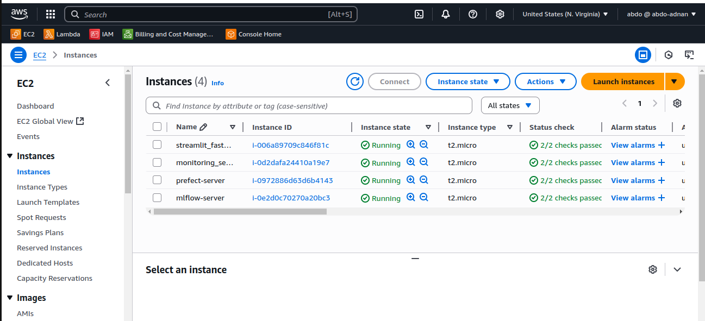
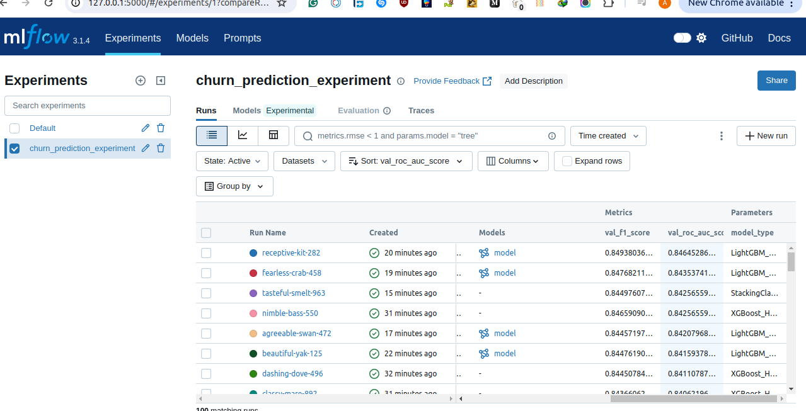
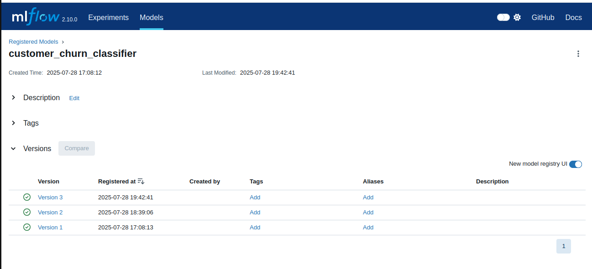
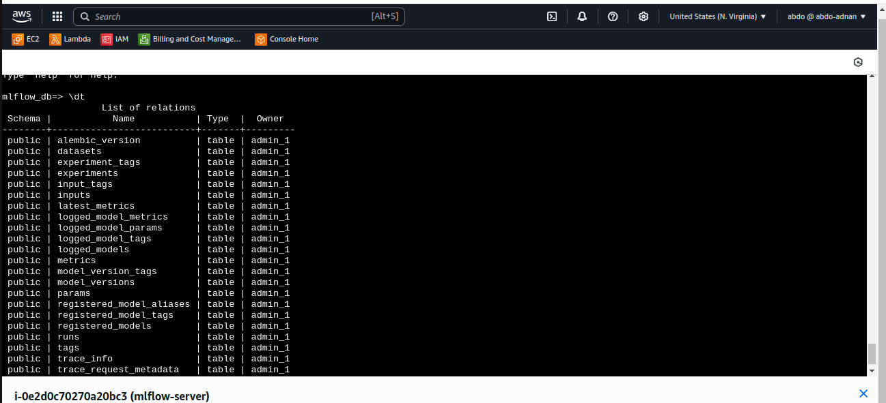
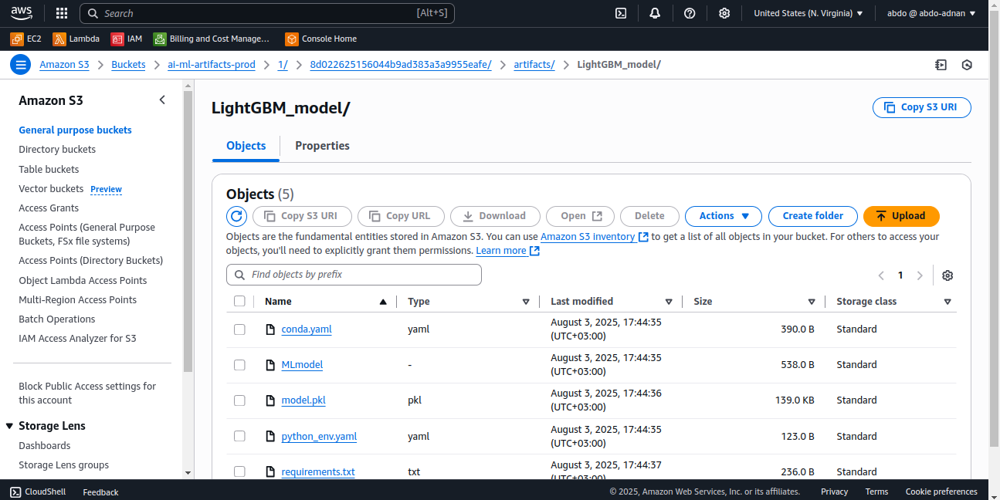
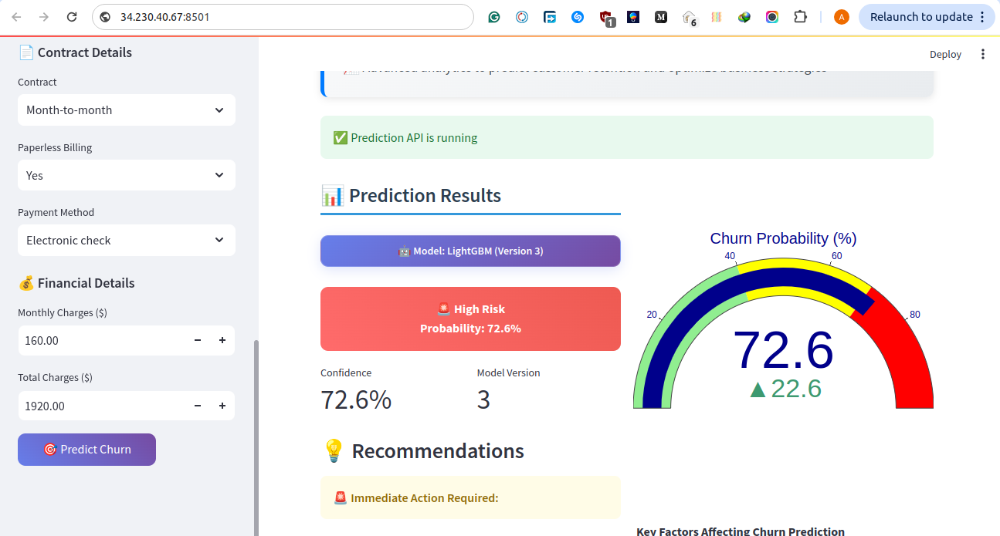
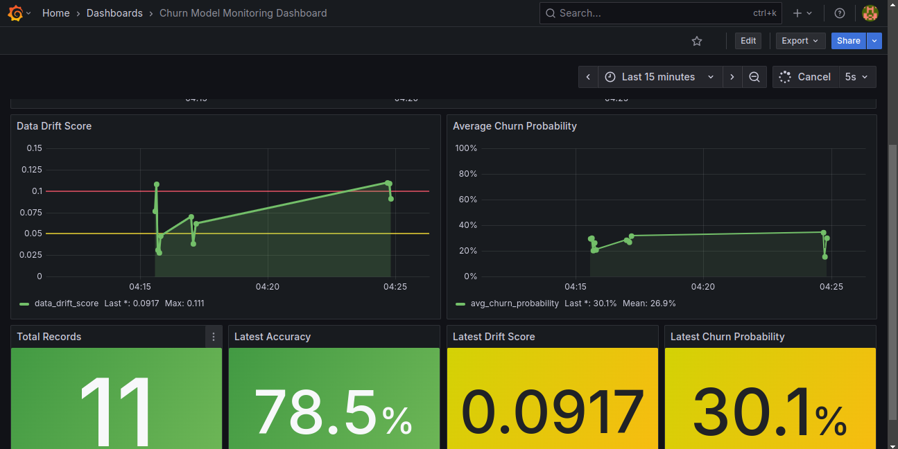
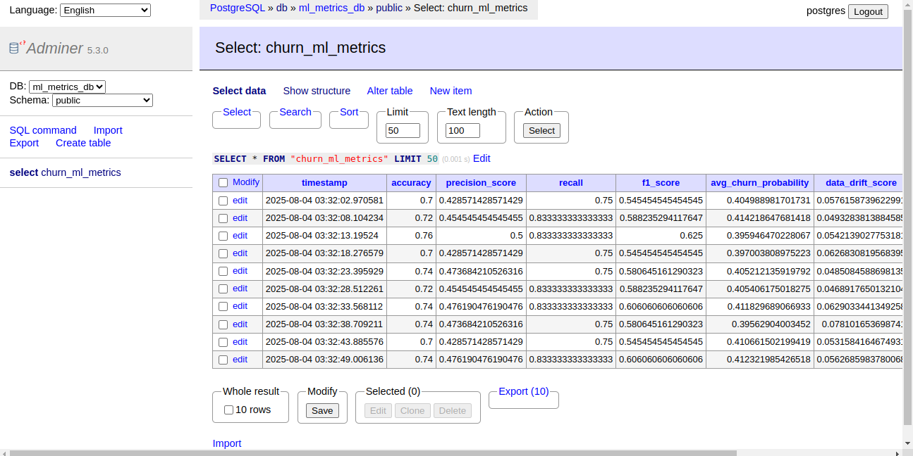

# Customer Churn Prediction MLOps System

A complete machine learning operations (MLOps) system that predicts customer churn for telecommunications companies. This project demonstrates production-ready ML practices including experiment tracking, automated workflows, cloud deployment, and real-time monitoring.


## Table of Contents
- [Problem & Business Value](#problem--business-value)
- [Quick Start](#quick-start)
- [System Architecture](#system-architecture)
- [MLOps Implementation](#mlops-implementation)
- [Development Workflow](#development-workflow)
- [CI/CD Pipeline](#cicd-pipeline)
- [Deployment Guide](#deployment-guide)
- [Monitoring & Maintenance](#monitoring--maintenance)

## Problem & Business Value

**What is Customer Churn?**
Customer churn occurs when customers stop using a company's services. For telecom companies, this directly impacts revenue and increases customer acquisition costs.

**Business Impact:**
- It costs 5x more to acquire new customers than retain existing ones
- Early churn prediction enables proactive retention campaigns
- Reduces customer acquisition costs by 15-20%
- Increases customer lifetime value through targeted interventions

**Solution:**
This ML system analyzes customer data (demographics, usage patterns, billing history) to predict churn probability and recommend retention strategies.

**Dataset:** [Telco Customer Churn](https://www.kaggle.com/datasets/blastchar/telco-customer-churn/data)
- 7,043 customers with churn status
- 21 features (demographics, services, billing)
- Binary classification target (Churn: Yes/No)

## Quick Start

### Prerequisites
- Docker & Docker Compose
- Python 3.9+
- Git

### 1. Setup Project
```bash
# Clone repository
git clone <repository-url>
cd customer-churn-prediction

# Setup environment
make install
make setup-data
```

### 2. Start Services
```bash
# Build and start all services
make build
make up

# Check system health
make health-check
```

### 3. Access Applications
- **Streamlit Dashboard**: http://localhost:8501
- **FastAPI Docs**: http://localhost:8000/docs
- **MLflow UI**: http://localhost:5000
- **Grafana Monitoring**: http://localhost:3000

### 4. Train Your First Model
```bash
# Process data and train models
make train

# View experiments in MLflow UI
# Best model will be automatically registered
```

## System Architecture

### Infrastructure Overview


**Cloud Infrastructure (AWS):**
- **4 EC2 Instances**: Web App, MLflow, Prefect, Monitoring
- **1 RDS PostgreSQL**: Stores MLflow metadata and monitoring metrics
- **1 S3 Bucket**: Model artifacts and training data storage
- **VPC + Load Balancer**: Security and scalability

### Technology Stack

**Core ML Stack:**
```
Python 3.9 + Scikit-learn + XGBoost + LightGBM
```

**MLOps Tools:**
- **MLflow**: Experiment tracking & model registry
- **Prefect**: Workflow orchestration & scheduling
- **Evidently**: Data drift monitoring
- **Docker**: Containerization & deployment

**Web Services:**
- **FastAPI**: REST API for predictions
- **Streamlit**: Interactive dashboard
- **Grafana**: Monitoring dashboards

**Infrastructure:**
- **Terraform**: Infrastructure as Code
- **Docker**: Containerization & deployment
- **AWS**: Cloud platform (EC2, RDS, S3)

### Technology Stack Overview

| Category | Technology | Purpose | Version |
|----------|------------|---------|---------|
| **Language** | Python | Core development language | 3.9+ |
| **ML Libraries** | Scikit-learn | Traditional ML algorithms | Latest |
|  | XGBoost | Gradient boosting | Latest |
|  | LightGBM | Gradient boosting | Latest |
|  | Pandas | Data manipulation | Latest |
|  | NumPy | Numerical computing | Latest |
| **MLOps** | MLflow | Experiment tracking & model registry | Latest |
|  | Prefect | Workflow orchestration | Latest |
|  | Evidently | Data drift monitoring | Latest |
| **Web Framework** | FastAPI | REST API backend | Latest |
|  | Streamlit | Dashboard frontend | Latest |
| **Database** | PostgreSQL | Metadata & metrics storage | 13+ |
|  | SQLite | Local development database | Latest |
| **Monitoring** | Grafana | Monitoring dashboards | Latest |
|  | Prometheus | Metrics collection | Latest |
| **Infrastructure** | Docker | Containerization | Latest |
|  | Docker Compose | Local orchestration | Latest |
|  | Terraform | Infrastructure as Code | Latest |
| **Cloud** | AWS EC2 | Compute instances | - |
|  | AWS RDS | Managed database | - |
|  | AWS S3 | Object storage | - |
| **Testing** | Pytest | Testing framework | Latest |
|  | Locust | Performance testing | Latest |
| **Code Quality** | Black | Code formatting | Latest |
|  | Flake8 | Linting | Latest |
|  | Bandit | Security scanning | Latest |

## MLOps Implementation

### 1. Experiment Tracking & Model Registry



**MLflow Features:**
- **Automated Tracking**: All experiments logged with metrics, parameters, and artifacts
- **Model Comparison**: Side-by-side comparison of different algorithms
- **Versioning**: Complete model lineage from data to deployment



**Model Registry Workflow:**
```
Development → Staging → Production → Archived
```
- Best performing models automatically registered
- Version control with easy rollback capabilities
- A/B testing support for model comparison

### 2. Cloud Storage & Metadata Management



**Database Integration:**
- MLflow server on EC2 connects to RDS PostgreSQL
- Scalable metadata storage for experiments and models
- High availability with automated backups



**Artifact Storage:**
- Model artifacts automatically stored in S3
- Versioned storage for models, preprocessors, and evaluation plots
- Reliable and scalable storage with 99.999999999% durability

### 3. Web Application & User Interface



**User-Friendly Interface:**
- **Business Users**: Streamlit dashboard for easy predictions
- **Developers**: FastAPI with automatic OpenAPI documentation
- **Real-time Predictions**: Instant churn probability scoring

### 4. Monitoring & Observability



**Comprehensive Monitoring:**
- **System Health**: Infrastructure and application metrics
- **Model Performance**: Accuracy, latency, and drift detection
- **Business Metrics**: Churn rates and revenue impact
- **Automated Alerts**: Notifications for performance degradation



**Metrics Storage:**
- All monitoring data stored in PostgreSQL
- Historical analysis and trend tracking
- Custom business KPIs and technical metrics

### 5. Workflow Orchestration

**Prefect Implementation:**
```python
# Example training flow
@flow(name="churn-training-pipeline")
def training_pipeline():
    # 1. Data validation
    data = validate_data()

    # 2. Feature engineering
    features = build_features(data)

    # 3. Model training
    models = train_models(features)

    # 4. Model evaluation
    best_model = evaluate_models(models)

    # 5. Model registration
    register_model(best_model)
```

**Scheduling & Automation:**
- **Weekly Retraining**: Automatic model updates with new data
- **Drift Detection**: Trigger retraining when data drift exceeds thresholds
- **Error Recovery**: Automatic retries and failure notifications

## Development Workflow

### Project Structure
```
├── data/                        # Dataset storage
│   ├── raw/                    # Original datasets
│   ├── processed/              # Clean data ready for ML
│   ├── interim/                # Intermediate processing steps
│   └── external/               # External data sources
├── models/                      # Trained model artifacts
├── tests/                       # Test suite
│   ├── unit/                   # Unit tests
│   ├── integration/            # Integration tests
│   ├── e2e/                    # End-to-end tests
│   └── performance/            # Performance tests
├── reports/                     # Generated reports
│   └── figures/                # Visualizations
├── services/                    # Application services
│   ├── web-app/                # FastAPI + Streamlit apps
│   ├── training/               # ML training pipeline
│   └── monitoring/             # Monitoring services
├── docker/                      # Docker configurations
├── monitoring/                  # Monitoring setup & dashboards
├── Infrastructure as code (IaC)/ # Terraform configs
├── images/                      # Project images & documentation
├── logs/                        # Application logs
├── mlartifacts/                # MLflow artifacts
├── mlruns/                     # MLflow experiment runs
├── scripts/                     # Utility scripts & cron jobs
├── docker-compose.yml          # Docker services configuration
├── docker-compose.mlops.yml    # MLOps services configuration
├── Makefile                    # Development & CI/CD commands
├── requirements.txt           # Python dependencies
└── pyproject.toml             # Project configuration
```

### Testing Framework

Simple testing approach with basic tests:

**1. Unit Tests (`tests/unit/`)**
- Test individual functions
- Quick tests with no external services
```bash
make test-unit
```

**2. Integration Tests (`tests/integration/`)**
- Test service connections
- Check if APIs work together
```bash
make test-integration
```

**3. End-to-End Tests (`tests/e2e/`)**
- Test complete workflows
- Check full prediction process
```bash
make test-e2e
```

**4. Performance Tests (`tests/performance/`)**
- Basic performance checks
- Test response times
```bash
make performance-test
```

### Development Commands

**Setup & Environment:**
```bash
make install          # Setup Python environment
make setup-data       # Create data directories
make build            # Build Docker images
```

**Development:**
```bash
make up               # Start all services
make down             # Stop all services
make logs             # View service logs
make health-check     # Test system health
```

**Training & Testing:**
```bash
make train            # Run ML training pipeline
make test             # Run test suite
make test-coverage    # Run tests with coverage
```

**Code Quality:**
```bash
make lint             # Check code quality
make format           # Format code (black, isort)
make pre-commit       # Run pre-commit hooks
```

## CI/CD Pipeline

### Makefile Automation

The Makefile provides comprehensive development automation:

**Setup & Environment:**
```bash
make install          # Setup Python environment
make setup-data       # Create data directories
make build            # Build Docker images
```

**Development:**
```bash
make up               # Start all services
make down             # Stop all services
make logs             # View service logs
make health-check     # Test system health
```

**Training & Testing:**
```bash
make train            # Run ML training pipeline
make test             # Run test suite
make test-coverage    # Run tests with coverage
```

**Code Quality:**
```bash
make lint             # Check code quality
make format           # Format code (black, isort)
make security-scan    # Security vulnerability scan
```

**CI/CD Pipeline Commands:**
```bash
make ci                   # Run complete CI pipeline
make build-for-prod       # Build production Docker images
make deploy-staging       # Deploy to staging environment
make deploy-production    # Deploy to production
make deploy-aws          # Deploy to AWS
```

**Testing Commands:**
```bash
make test-unit           # Run unit tests
make test-integration    # Run integration tests
make test-e2e           # Run end-to-end tests
make performance-test    # Run performance tests
```

### Makefile CI/CD Implementation

Here are key Makefile targets for CI/CD automation:

**Complete CI Pipeline:**
```makefile
ci: clean-code install lint security-scan test-coverage
	@echo "✓ CI pipeline completed successfully"
```

**Production Build:**
```makefile
build-for-prod:
	@echo "Building production Docker images..."
	@docker build -t churn-prediction:latest -f docker/Dockerfile .
	@docker build -t churn-training:latest -f docker/training/Dockerfile .
	@docker build -t churn-monitoring:latest -f docker/monitoring/Dockerfile .
```

**Local Deployment:**
```makefile
deploy-local: build-for-prod
	@echo "Deploying locally..."
	@docker-compose -f docker-compose.mlops.yml up -d
	@echo "✓ Local deployment completed"
```

**AWS Deployment:**
```makefile
deploy-aws:
	@echo "Deploying to AWS..."
	@cd "Infrastructure as code (IaC)" && terraform apply -auto-approve
	@echo "✓ Deployed to AWS"
```

**Health Checks:**
```makefile
health-check:
	@echo "Checking system health..."
	@curl -s http://localhost:5000/health > /dev/null && echo "✓ MLflow ready"
	@curl -s http://localhost:8000/health > /dev/null && echo "✓ FastAPI ready"
	@curl -s http://localhost:8501 > /dev/null && echo "✓ Streamlit ready"
```

## Deployment Guide

### Local Development

**1. Initial Setup:**
```bash
git clone <repository-url>
cd customer-churn-prediction
make install setup-data
```

**2. Start Development Environment:**
```bash
make build up
```

**3. Verify Setup:**
```bash
make health-check
```

### Local Production Deployment

For local production-like deployment with all services:

**1. Deploy Locally:**
```bash
# Install and setup environment
make install
make setup-data

# Build and start all production services
make deploy-local

# Verify deployment
make health-check
```

**2. Access Services:**
- **Web Application**: http://localhost:8501
- **API Documentation**: http://localhost:8000/docs
- **MLflow UI**: http://localhost:5000
- **Grafana Monitoring**: http://localhost:3000

**3. Stop Services:**
```bash
make down
```

### AWS Production Deployment

**1. Infrastructure Setup:**
```bash
cd "Infrastructure as code (IaC)"
terraform init
terraform plan
terraform apply
```

**2. Application Deployment:**
```bash
make deploy-aws
```

**3. Production Verification:**
```bash
make test-production
```

### Environment Management

**Development:**
- Local Docker containers
- SQLite databases
- Local file storage

**Staging:**
- AWS EC2 instances
- RDS PostgreSQL
- S3 storage

**Production:**
- Auto-scaling groups
- Multi-AZ RDS
- CloudFront CDN

## Automated Scheduling & Cron Jobs

### Automated Training Pipeline

Set up automated model retraining every 3 days at 9 AM:

**Cron Job Configuration:**
```bash
# Edit crontab
crontab -e

# Add this line for training every 3 days at 9 AM
0 9 */3 * * cd /home/user/customer-churn-prediction && docker-compose run --rm training python services/training/churn_mlops_pipeline.py >> logs/training_cron.log 2>&1
```

**Docker Container Cron Command:**
```bash
# Run training container every 3 days at 9 AM
0 9 */3 * * docker run --rm -v $(pwd):/app churn-training:latest python /app/services/training/churn_mlops_pipeline.py
```

### Automated Monitoring Pipeline

Set up automated metrics generation every hour:

**Monitoring Cron Job:**
```bash
# Edit crontab
crontab -e

# Add this line for monitoring every hour
0 * * * * cd /home/user/customer-churn-prediction && docker-compose run --rm monitoring python services/monitoring/monitor_churn_model.py >> logs/monitoring_cron.log 2>&1
```

**Docker Container Monitoring Command:**
```bash
# Run monitoring container every hour
0 * * * * docker run --rm -v $(pwd):/app churn-monitoring:latest python /app/services/monitoring/monitor_churn_model.py
```

### Cron Job Setup Script

Create a setup script for cron jobs:

```bash
# scripts/setup_cron.sh
#!/bin/bash

# Add training cron job (every 3 days at 9 AM)
echo "0 9 */3 * * cd $(pwd) && docker-compose run --rm training python services/training/churn_mlops_pipeline.py >> logs/training_cron.log 2>&1" | crontab -

# Add monitoring cron job (every hour)
echo "0 * * * * cd $(pwd) && docker-compose run --rm monitoring python services/monitoring/monitor_churn_model.py >> logs/monitoring_cron.log 2>&1" | crontab -

echo "Cron jobs configured successfully!"
echo "Training: Every 3 days at 9 AM"
echo "Monitoring: Every hour"
```

**Run the setup:**
```bash
chmod +x scripts/setup_cron.sh
./scripts/setup_cron.sh
```

**View active cron jobs:**
```bash
crontab -l
```

**View cron logs:**
```bash
tail -f logs/training_cron.log
tail -f logs/monitoring_cron.log
```

## Monitoring & Maintenance

### Daily Operations

**Health Monitoring:**
```bash
make health-check        # System health
make monitor-metrics     # View key metrics
make check-alerts        # Review alerts
```

**Performance Monitoring:**
```bash
make model-performance   # Model accuracy metrics
make api-performance     # API response times
make system-resources    # CPU, memory usage
```

### Weekly Maintenance

**Model Updates:**
```bash
make retrain-models      # Train with new data
make evaluate-models     # Compare model performance
make deploy-best-model   # Deploy improved models
```

**System Maintenance:**
```bash
make backup-data         # Backup important data
make update-dependencies # Update packages
make security-audit      # Security scan
```

### Troubleshooting

**Common Issues:**

1. **Service Not Starting:**
   ```bash
   make logs               # Check service logs
   make restart-service    # Restart specific service
   ```

2. **Model Prediction Errors:**
   ```bash
   make validate-model     # Check model integrity
   make test-predictions   # Test with sample data
   ```

3. **Performance Issues:**
   ```bash
   make profile-system     # System profiling
   make optimize-queries   # Database optimization
   ```

## API Usage Examples

### Single Prediction
```python
import requests

# Predict churn for a customer
response = requests.post("http://localhost:8000/predict", json={
    "tenure": 12,
    "MonthlyCharges": 70.5,
    "Contract": "Month-to-month",
    "PaymentMethod": "Electronic check",
    "gender": "Female",
    "SeniorCitizen": 0,
    "Partner": "Yes",
    "Dependents": "No"
})

result = response.json()
print(f"Churn Probability: {result['churn_probability']:.2%}")
print(f"Risk Level: {result['risk_level']}")
```
-----------------------
